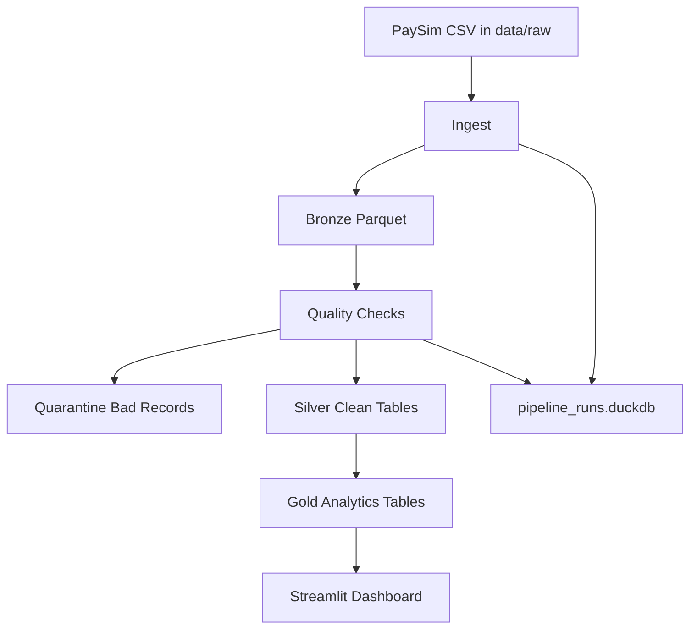
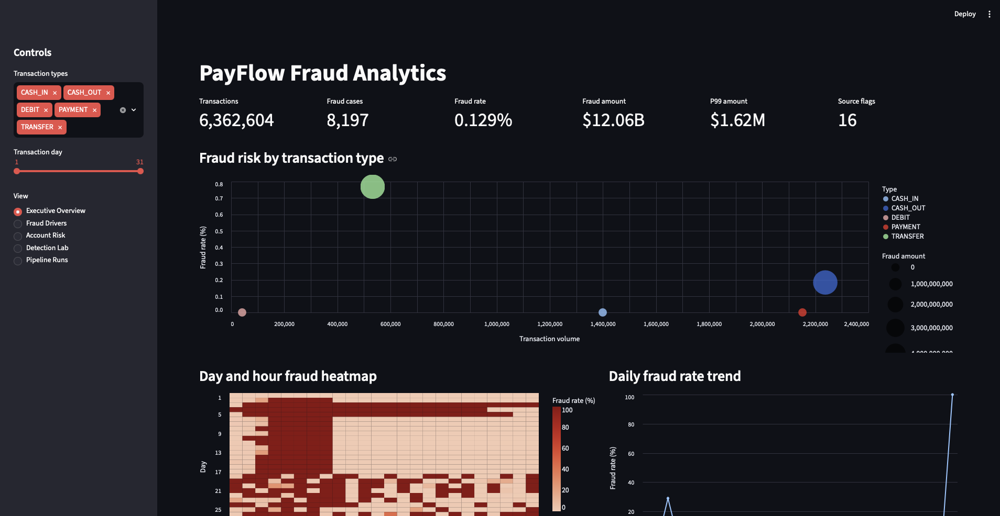
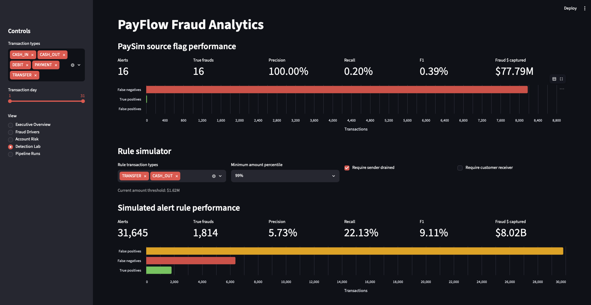
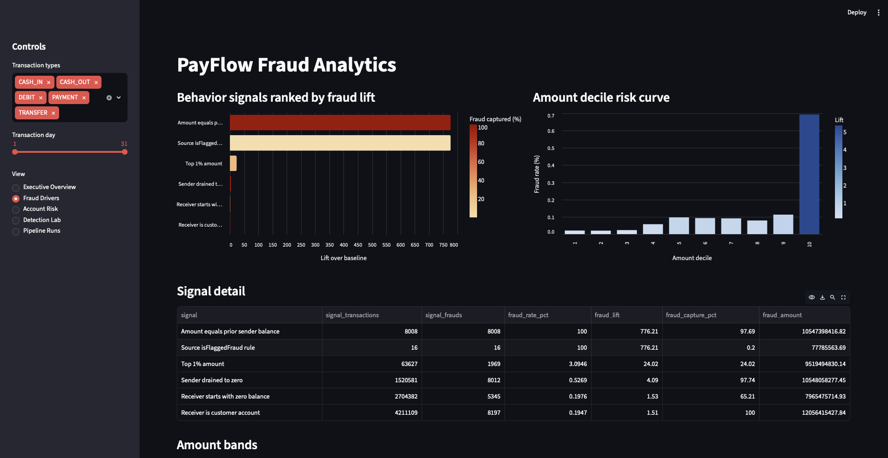

# PayFlow Fraud Analytics Lakehouse

PayFlow is a local data engineering and analytics project built around mobile-money fraud transactions. It uses the PaySim synthetic financial fraud dataset and turns a raw CSV file into a small but realistic lakehouse with raw, bronze, silver, gold, quality, metadata, and dashboard layers.

The goal is to show more than exploratory data analysis. This project behaves like a real pipeline: it ingests source data, writes Parquet lake storage, validates records, quarantines bad rows, builds analytics-ready tables, records pipeline history, and serves a fraud-monitoring dashboard.

## Why This Project Exists

Fraud analytics teams need clean transaction data, reliable quality checks, and clear risk indicators. A dashboard is only useful if the data behind it is trustworthy and structured for analysis.

This project answers questions such as:

- How many transactions and fraud cases exist in the dataset?
- Which transaction types are riskier than the overall baseline?
- Which hours and days show unusual fraud concentration?
- Which account behaviors are strong fraud signals?
- How much fraud does the original `isFlaggedFraud` source rule catch?
- Can a simple custom alert rule improve recall?
- Which accounts should be prioritized for investigation?

## Dataset

The project uses the PaySim Synthetic Financial Fraud Dataset from Kaggle:

https://www.kaggle.com/datasets/ealaxi/paysim1/data

PaySim contains synthetic mobile-money transactions with fraud labels. It is useful for a fresher data engineering portfolio because it is finance-related, privacy-safe, large enough to require real processing, and simple enough to explain clearly.

Important source columns:

| Column | Meaning |
| --- | --- |
| `step` | Time step in hours |
| `type` | Transaction type such as `TRANSFER`, `CASH_OUT`, `PAYMENT` |
| `amount` | Transaction amount |
| `nameOrig` | Sender account |
| `oldbalanceOrg` | Sender balance before transaction |
| `newbalanceOrig` | Sender balance after transaction |
| `nameDest` | Receiver account |
| `oldbalanceDest` | Receiver balance before transaction |
| `newbalanceDest` | Receiver balance after transaction |
| `isFraud` | Fraud label, `1` means fraud |
| `isFlaggedFraud` | Original source-system fraud flag |

Expected local file:

```text
data/raw/PS_20174392719_1491204439457_log.csv
```

## Tech Stack

| Tool | Purpose |
| --- | --- |
| Python | Pipeline orchestration |
| DuckDB | Local SQL engine for CSV, Parquet, and analytics queries |
| Parquet | Lakehouse storage format |
| Streamlit | Interactive fraud dashboard |
| Altair | Rich visualizations inside Streamlit |
| pytest | Unit tests for structure and quality logic |

## Architecture



Layer responsibilities:

| Layer | Purpose |
| --- | --- |
| Raw | Keeps the original downloaded CSV unchanged |
| Bronze | Stores the loaded source data as partitioned Parquet |
| Quality | Scores records against validation rules |
| Quarantine | Stores invalid records for inspection |
| Silver | Creates clean, typed, deduplicated analytical tables |
| Gold | Creates business-facing fraud marts and alert tables |
| Dashboard | Explains fraud patterns, risk drivers, and rule performance |

## Folder Structure

```text
payflow-fraud-lakehouse/
  data/
    raw/
    bronze/
    silver/
    gold/
    quarantine/
  dashboard/
    app.py
  screenshots/
    dashboard-overview.png
    executive-overview.png
    detection-lab.png
    fraud-drivers.png
  sql/
    silver_transactions.sql
    silver_accounts.sql
    silver_transaction_types.sql
    gold_fraud_summary.sql
    gold_fraud_by_transaction_type.sql
    gold_high_risk_accounts.sql
    gold_hourly_fraud_trend.sql
    gold_large_transaction_alerts.sql
  src/
    config.py
    db.py
    ingest.py
    quality.py
    transform.py
    run_pipeline.py
  tests/
    test_project_structure.py
    test_quality_rules.py
  pipeline_runs.duckdb
  requirements.txt
  pyproject.toml
  README.md
```

## Pipeline Scripts

| Script | What it does |
| --- | --- |
| `src/ingest.py` | Reads the PaySim CSV with DuckDB and writes partitioned bronze Parquet |
| `src/quality.py` | Runs data quality rules and writes bad rows to quarantine |
| `src/transform.py` | Builds silver and gold Parquet tables using SQL models |
| `src/run_pipeline.py` | Runs ingest, quality, and transform as one pipeline |
| `src/db.py` | Shared DuckDB helpers, metadata tables, and Parquet view helpers |
| `src/config.py` | Centralized project paths and expected transaction types |

## Project Documents

| Document | Purpose |
| --- | --- |
| [BRD.md](BRD.md) | Business Requirements Document explaining the problem, objectives, stakeholders, scope, metrics, risks, and expected business outcome |
| [FRD.md](FRD.md) | Functional Requirements Document describing the pipeline, tables, dashboard pages, calculations, tests, and acceptance criteria |

## Tables Built

Bronze:

| Table | Description |
| --- | --- |
| `bronze_transactions` | Source transactions loaded from CSV and stored as partitioned Parquet |

Silver:

| Table | Description |
| --- | --- |
| `silver_transactions` | Clean transaction table with typed columns, derived day/hour, normalized names, and deduplication |
| `silver_accounts` | Account-level activity table showing sent, received, fraud touch rate, and amount touched |
| `silver_transaction_types` | Transaction-type profile with volume, fraud counts, fraud rate, and amount metrics |

Gold:

| Table | Description |
| --- | --- |
| `gold_fraud_summary_daily` | Daily transaction count, fraud count, fraud rate, and fraud amount |
| `gold_fraud_by_transaction_type` | Fraud exposure by transaction type |
| `gold_high_risk_accounts` | Account risk ranking based on fraud activity and amount touched |
| `gold_hourly_fraud_trend` | Fraud trend by transaction hour |
| `gold_large_transaction_alerts` | High-value suspicious transaction alerts |

Quality and metadata:

| Table | Description |
| --- | --- |
| `quarantine_bad_transactions` | Invalid rows that failed quality checks |
| `quality_results` | Check-level pass/fail metrics |
| `pipeline_runs` | Pipeline run history, status, row counts, and notes |

## Data Quality Checks

Bad records are written to:

```text
data/quarantine/quarantine_bad_transactions.parquet
```

Implemented checks:

| Check | Why it matters |
| --- | --- |
| Amount must be greater than zero | Transactions with zero or negative amounts are invalid for this use case |
| Transaction type must be expected | Prevents unknown categories from entering analytics |
| Sender account must exist | Sender is required for account risk analysis |
| Receiver account must exist | Receiver is required for network and destination analysis |
| Fraud flag must be `0` or `1` | Keeps labels usable for supervised analytics |
| Source flagged fraud must be `0` or `1` | Keeps source-rule performance measurable |
| Duplicate transaction rows are detected | Prevents repeated records from inflating KPIs |
| Balance columns cannot be negative or null | Avoids impossible balance states in downstream calculations |

In the full local run, the pipeline processed `6,362,620` bronze rows, quarantined `16` bad rows, and produced `6,362,604` clean silver rows.

## Dashboard

Launch with:

```bash
streamlit run dashboard/app.py
```

The dashboard is designed to explain fraud behavior, not just display counts.

### Dashboard Screenshots

Executive Overview:



This page summarizes the complete clean dataset after quality checks: `6,362,604` valid transactions, `8,197` fraud cases, a `0.129%` fraud rate, about `$12.06B` in fraud amount, a P99 transaction amount of about `$1.62M`, and only `16` transactions marked by the original source flag. It also shows transaction-type fraud risk, day/hour fraud heatmap, and daily fraud-rate trend.

Detection Lab:



This page compares the original PaySim source flag against a custom alert rule. It shows why precision alone is not enough: the source flag has `100.00%` precision but only `0.20%` recall, while the custom rule captures about `$8.02B` in fraud amount with higher recall.

Fraud Drivers:



This page explains which behaviors are most strongly associated with fraud. It ranks signals by fraud lift, shows the amount-decile risk curve, and displays the detailed signal table used to interpret fraud patterns.

Dashboard pages:

| Page | What it explains |
| --- | --- |
| Executive Overview | Overall fraud KPIs, P99 amount, source flags, transaction-type risk, day/hour heatmap, and daily fraud trend |
| Fraud Drivers | Which behavioral signals have the highest fraud lift, plus amount-decile risk |
| Account Risk | Highest-risk accounts, risk-score ranking, and fraud loss concentration |
| Detection Lab | Precision, recall, F1, and fraud amount captured by source and custom alert rules |
| Pipeline Runs | Recent pipeline runs and latest quality results |

Interactive filters:

- Transaction type
- Transaction day range
- Rule simulator transaction types
- Rule simulator amount percentile
- Whether to require sender balance drain
- Whether to require customer receiver accounts

## What We Found In The Dashboard

The dashboard reveals that fraud is not evenly distributed across the dataset. Most transaction volume is normal, but fraud is concentrated in specific transaction types, amount bands, and balance behaviors.

### 1. Overall Fraud Is Rare But High Value


| Metric | Finding |
| --- | ---: |
| Clean transactions analyzed | 6,362,604 |
| Fraud transactions | 8,197 |
| Overall fraud rate | 0.129% |
| Total fraud amount | About $12.06B |
| P99 transaction amount | About $1.62M |
| Source flagged transactions | 16 |

Interpretation:

- Fraud is rare by count, but very large by value.
- A low fraud rate means raw counts alone can be misleading.
- The dashboard therefore uses lift, amount exposure, and rule performance instead of only totals.

### 2. Fraud Is Concentrated In `TRANSFER` And `CASH_OUT`

| Transaction type | Total transactions | Fraud transactions | Fraud rate | Fraud lift | Fraud amount |
| --- | ---: | ---: | ---: | ---: | ---: |
| `TRANSFER` | 532,909 | 4,097 | 0.7688% | 5.97x | About $6.07B |
| `CASH_OUT` | 2,237,484 | 4,100 | 0.1832% | 1.42x | About $5.99B |
| `PAYMENT` | 2,151,495 | 0 | 0.0000% | 0.00x | $0 |
| `DEBIT` | 41,432 | 0 | 0.0000% | 0.00x | $0 |
| `CASH_IN` | 1,399,284 | 0 | 0.0000% | 0.00x | $0 |

Interpretation:

- `TRANSFER` is the riskiest transaction type by fraud rate and lift.
- `CASH_OUT` has almost the same number of fraud cases as `TRANSFER`, but its fraud rate is lower because it has much higher volume.
- `PAYMENT`, `DEBIT`, and `CASH_IN` show no fraud labels in this PaySim run.
- This is why the dashboard uses both fraud count and fraud lift: volume and risk are different ideas.

### 3. Balance Behavior Is A Strong Fraud Signal


The Fraud Drivers page shows that certain account-balance patterns are highly predictive in this synthetic dataset.

| Signal | Transactions matching signal | Fraud cases captured | Fraud rate inside signal | Fraud captured |
| --- | ---: | ---: | ---: | ---: |
| Amount equals prior sender balance | 8,008 | 8,008 | 100.0000% | 97.69% |
| Sender drained to zero | 1,520,581 | 8,012 | 0.5269% | 97.74% |
| Top 1% transaction amount | 63,627 | 1,969 | 3.0946% | 24.02% |
| Receiver starts with zero balance | 2,704,382 | 5,345 | 0.1976% | 65.21% |
| Receiver is customer account | 4,211,109 | 8,197 | 0.1947% | 100.00% |

Interpretation:

- Many fraud transactions drain the sender balance to zero.
- The strongest synthetic signal is when the transaction amount exactly equals the sender's prior balance.
- Top 1% transaction amounts are much riskier than normal transactions and represent a large fraud-value exposure.
- These patterns are useful for learning fraud analytics, but in a real production dataset they should be validated carefully because synthetic data can contain very clean rule-like behavior.

### 4. The Original Source Fraud Flag Is Too Conservative


The Detection Lab compares the original `isFlaggedFraud` field against the actual fraud labels.

| Metric | Source flag result |
| --- | ---: |
| Alerts raised | 16 |
| True frauds caught | 16 |
| False positives | 0 |
| False negatives | 8,181 |
| Precision | 100.00% |
| Recall | 0.20% |
| F1 score | 0.39% |
| Fraud amount captured | About $77.79M |
| Fraud amount recall | 0.65% |

Interpretation:

- The source flag is very precise: every alert is actually fraud.
- But it misses almost all fraud cases.
- This is a classic fraud-monitoring tradeoff: a rule can be highly accurate when it fires but still fail operationally because recall is too low.

### 5. A Simple Custom Rule Captures More Fraud Value

The default Detection Lab simulator rule uses:

```text
transaction_type IN ('TRANSFER', 'CASH_OUT')
AND amount >= P99 amount threshold
AND sender is drained
```

With the full dataset, this rule gives:

| Metric | Custom rule result |
| --- | ---: |
| Amount threshold | About $1.62M |
| Alerts raised | 31,645 |
| True frauds caught | 1,814 |
| False positives | 29,831 |
| False negatives | 6,383 |
| Precision | 5.73% |
| Recall | 22.13% |
| F1 score | 9.11% |
| Fraud amount captured | About $8.02B |
| Fraud amount recall | 66.54% |

Interpretation:

- The custom rule catches far more fraud value than the original source flag.
- It captures about two-thirds of fraud amount, but at the cost of many more alerts.
- This is useful for showing how fraud teams balance alert volume, review workload, precision, and loss prevention.
- In an interview, this is a strong talking point because it shows that you evaluated rules using precision, recall, F1, and business value.

### 6. Main Business Conclusion

The dashboard shows that fraud risk is concentrated around high-value `TRANSFER` and `CASH_OUT` behavior, especially when sender accounts are drained. The original source flag is extremely precise but misses most fraud. A broader custom rule catches much more fraud value, but it would require alert triage because precision is lower.

This is the main business insight of the project: fraud monitoring is not just about finding suspicious transactions; it is about designing detection rules that balance risk capture against operational workload.

## Key Analytics Calculations

Fraud rate:

```text
fraud_rate = fraud_transactions / total_transactions
```

Fraud lift:

```text
fraud_lift = segment_fraud_rate / overall_fraud_rate
```

This shows whether a group is riskier than the dataset baseline. For example, in the full run, `TRANSFER` transactions have much higher fraud lift than the overall baseline.

Excess fraud vs baseline:

```text
excess_fraud = actual_fraud_count - expected_fraud_count_at_baseline_rate
```

This helps separate high-risk segments from merely high-volume segments.

Sender drained signal:

```text
sender_old_balance > 0
AND sender_new_balance = 0
AND amount >= sender_old_balance * 0.95
```

This captures transactions where the sender account is nearly or fully drained. In this dataset, this is a strong fraud signal.

Amount decile risk:

```text
NTILE(10) OVER (ORDER BY amount)
```

Transactions are split into ten amount bands. The dashboard compares fraud rate across those bands to show whether large transactions are disproportionately risky.

Rule precision:

```text
precision = true_positives / alerts
```

Precision answers: when the rule alerts, how often is it correct?

Rule recall:

```text
recall = true_positives / all_frauds
```

Recall answers: out of all fraud cases, how many did the rule catch?

F1 score:

```text
F1 = 2 * precision * recall / (precision + recall)
```

F1 balances precision and recall.

Fraud amount recall:

```text
fraud_amount_recall = fraud_amount_captured_by_rule / total_fraud_amount
```

This is useful because a rule may catch fewer cases but still capture a large share of fraud value.

## How To Run

Create and activate the virtual environment:

```bash
python3 -m venv .venv
source .venv/bin/activate
pip install -r requirements.txt
```

Run a fast smoke test on a sample:

```bash
python src/run_pipeline.py --sample-rows 100000
```

Run the full dataset:

```bash
python src/run_pipeline.py
```

Run tests:

```bash
pytest
```

Launch dashboard:

```bash
streamlit run dashboard/app.py
```

## Example Full Run Results

| Metric | Value |
| --- | ---: |
| Bronze rows | 6,362,620 |
| Quarantined rows | 16 |
| Silver rows | 6,362,604 |
| Daily gold rows | 31 |
| Fraud transactions | 8,197 |
| Fraud rate | 0.129% |
| Fraud amount | About $12.06B |

## What Makes This More Than EDA

This project is structured like a real data engineering workflow:

- Raw data is kept separate from processed data.
- DuckDB performs scalable local SQL processing.
- Parquet is used as the lake storage format.
- Data quality checks run before analytical tables are built.
- Bad records are not silently dropped; they are quarantined.
- Transformations are reusable SQL models.
- Pipeline runs are recorded in a DuckDB metadata database.
- The dashboard uses business-facing metrics and explainable fraud calculations.
- Tests validate project structure and core quality-rule behavior.


